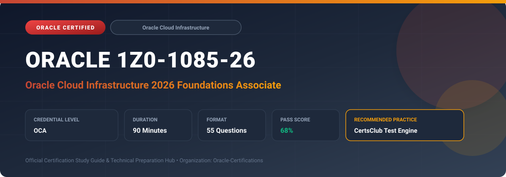

  

# Oracle 1Z0-1085-26: Oracle Cloud Infrastructure 2026 Foundations Associate

---

## 1. Exam Overview & Candidate Profile

The **Oracle 1Z0-1085-26: Oracle Cloud Infrastructure 2026 Foundations Associate** examination is engineered for enterprise architects, solution specialists, functional consultants, and implementation professionals seeking formal industry recognition of their proficiency in Oracle technologies.

The Oracle Cloud Infrastructure 2026 Foundations Associate (1Z0-1085-26) certification provides fundamental validation of core cloud computing concepts and Oracle Cloud Infrastructure services. It validates knowledge of physical and logical infrastructure components (Regions, Availability Domains, Fault Domains), core IaaS/PaaS services, security architecture, pricing models, and governance frameworks.

### Target Audience & Prerequisites
- **Target Roles**: Implementation Specialists, Cloud Architects, Technical Leads, Enterprise Functional Consultants, and Systems Engineers.
- **Recommended Experience**: 1–2 years of practical, hands-on experience designing, implementing, and maintaining corresponding Oracle Cloud solutions.
- **Credential Earned**: Oracle Certified Professional (OCA).

---

## 2. Key Exam Specifications

| Specification | Details |
| :--- | :--- |
| **Exam Code** | **Oracle 1Z0-1085-26** |
| **Official Title** | Oracle Cloud Infrastructure 2026 Foundations Associate |
| **Certification Track** | Oracle Cloud Infrastructure |
| **Exam Duration** | 90 Minutes |
| **Number of Questions** | 55 Questions |
| **Passing Score** | 68% |
| **Question Format** | Multiple Choice (Single/Multiple Answer), Scenario-Based Questions |
| **Delivery Provider** | Oracle University / Pearson VUE (Online Proctored or Test Center) |
| **Recommended Practice Engine** | [CertsClub Oracle Practice Tests](https://www.certsclub.com/oracle/1z0-1085-26-dumps.html) |

---

## 3. Official Blueprint & Exam Domain Breakdown

The examination assesses candidate competencies across core functional domains weighted as follows:

| Domain Area | Weighting |
| :--- | :--- |
| **Cloud Concepts & OCI Architecture Fundamentals** | `20%` |
| **Core OCI Compute, Storage & Database Services** | `30%` |
| **Virtual Cloud Networks (VCN) & Core Networking** | `20%` |
| **Security, Identity & Compliance Architecture** | `15%` |
| **Pricing, Billing, Cost Management & SLA Guarantees** | `15%` |

---

## 4. Deep Dive into Complex & Challenging Technical Topics

To secure a passing score on the 1Z0-1085-26 exam, candidates must master the following advanced concepts:

- **Understanding OCI physical topology**: multi-AD vs single-AD regions, fault domain fault isolation, and cross-region replication.
- **Evaluating OCI storage options**: Block Volume performance tiers, Object Storage tiers (Standard, Infrequent, Archive), and File Storage (NFS).
- **Virtual Cloud Network fundamentals**: public vs private subnets, Security Lists vs Network Security Groups (NSGs), and NAT/Service/Internet Gateways.
- **Cost governance**: Budgets, Cost Analysis, Compartment Quotas, and Oracle Universal Credits pricing model.

---

## 5. Scenario-Based Demo & Practice Questions

### Question 1
An organization wants to host a web application across two Compute instances within the same Availability Domain while protecting against localized hardware failure of a physical rack. Which OCI architectural component should be utilized?

A) Different Regions
B) Different Fault Domains
C) Different Compartments
D) Different Tenancies

- **Correct Answer**: `B) Different Fault Domains`  
- **Technical Explanation**: A Fault Domain is a grouping of hardware and infrastructure within an Availability Domain. Deploying instances across different Fault Domains protects against unexpected hardware failures and maintenance outages on shared physical power or rack equipment.

---

### Question 2
Which OCI Object Storage tier is optimized for data that is rarely accessed, requires immediate retrieval when requested, and incurs lower storage cost than the Standard tier?

A) Archive Storage Tier
B) Infrequent Access Tier
C) Cold Storage Tier
D) Block Volume Ultra High Performance

- **Correct Answer**: `B) Infrequent Access Tier`  
- **Technical Explanation**: The Infrequent Access tier is designed for data accessed infrequently but requiring instantaneous read access when needed, offering lower storage costs compared to Standard Object Storage.

---

## 6. Recommended Preparation Strategy & Practice Testing Engine

Achieving certification in **Oracle 1Z0-1085-26** requires balanced theoretical study and scenario-based simulation practice:

1. **Review Oracle Documentation**: Master architecture guides, implementation workbooks, and administration manuals on the Oracle Help Center.
2. **Hands-on Lab Practice**: Execute real-world configuration, policy setup, and troubleshooting tasks in your cloud tenancy or test instance.
3. **Simulated Exam Drills**: Practice answering timed, scenario-based multiple-choice questions to familiarize yourself with the question formats, traps, and timing constraints.

### Practice With CertsClub
For realistic practice questions, updated dumps, and mock testing environments:
- **Resource**: [CertsClub Oracle Practice Test Engine](https://www.certsclub.com/oracle/1z0-1085-26-dumps.html)
- **Special Discount**: Use coupon code **`club20`** during checkout for an instant **20% discount** on all practice exam bundles and testing engines.

---

## 7. Official Documentation & References

- [Oracle University Certification Registry](https://education.oracle.com/)
- [Oracle Help Center Documentation Portal](https://docs.oracle.com/)
- [Oracle Cloud Infrastructure & Applications Guides](https://docs.oracle.com/en/cloud/)
- [CertsClub Oracle Certification Exam Practice](https://www.certsclub.com/oracle/1z0-1085-26-dumps.html)

---

## 8. SEO & Discovery Keywords

`oracle 1z0-1085-26, oracle 1z0-1085-26 exam, oracle 1z0-1085-26 dumps, 1Z0-1085-26 practice questions, 1Z0-1085-26 study guide, oracle 1z0-1085-26 syllabus, oracle cloud infrastructure 2026 foundations associate, certsclub 1z0-1085-26`
